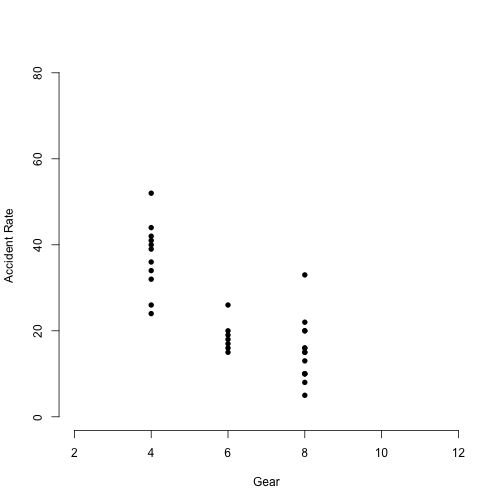

accident_rate_pres
========================================================
author: Bertrand Dolimier
date: Feb 25 2018
autosize: true

Accident rate per car type
========================================================

Available statistics demonstrate that beyond driver profile, number of the miles driven and regional specificilties, the type of cars has a correlation with the accident rate.

This presentation introduce a shiny application that allows to visualize this investigation.

Models
========================================================
Two models were done:

- Model based on car sizes only
- a Model on car sizes and sport-like feature

We researched the accident rate for the cars in the mtcars dataframe. 
And added a column to the data.frame for accident per millions miles driven.

Data shows that small cars (4 cylinders) are more dangerous, larger cars are safer until we get to sports car with cylinder above 10.

Enhanced mtcars
========================================================


```r
mtcars$accident <- c(18,19,39,15,10,26,20,32,42,17,16,8,15,10,10,5,16,44,36,40,41,16,20,13,15,34,24,26,33,20,22,52)
summary(mtcars)
```

```
      mpg             cyl             disp             hp       
 Min.   :10.40   Min.   :4.000   Min.   : 71.1   Min.   : 52.0  
 1st Qu.:15.43   1st Qu.:4.000   1st Qu.:120.8   1st Qu.: 96.5  
 Median :19.20   Median :6.000   Median :196.3   Median :123.0  
 Mean   :20.09   Mean   :6.188   Mean   :230.7   Mean   :146.7  
 3rd Qu.:22.80   3rd Qu.:8.000   3rd Qu.:326.0   3rd Qu.:180.0  
 Max.   :33.90   Max.   :8.000   Max.   :472.0   Max.   :335.0  
      drat             wt             qsec             vs        
 Min.   :2.760   Min.   :1.513   Min.   :14.50   Min.   :0.0000  
 1st Qu.:3.080   1st Qu.:2.581   1st Qu.:16.89   1st Qu.:0.0000  
 Median :3.695   Median :3.325   Median :17.71   Median :0.0000  
 Mean   :3.597   Mean   :3.217   Mean   :17.85   Mean   :0.4375  
 3rd Qu.:3.920   3rd Qu.:3.610   3rd Qu.:18.90   3rd Qu.:1.0000  
 Max.   :4.930   Max.   :5.424   Max.   :22.90   Max.   :1.0000  
       am              gear            carb          accident    
 Min.   :0.0000   Min.   :3.000   Min.   :1.000   Min.   : 5.00  
 1st Qu.:0.0000   1st Qu.:3.000   1st Qu.:2.000   1st Qu.:15.00  
 Median :0.0000   Median :4.000   Median :2.000   Median :20.00  
 Mean   :0.4062   Mean   :3.688   Mean   :2.812   Mean   :23.56  
 3rd Qu.:1.0000   3rd Qu.:4.000   3rd Qu.:4.000   3rd Qu.:33.25  
 Max.   :1.0000   Max.   :5.000   Max.   :8.000   Max.   :52.00  
```

Accident per Gear Size
========================================================

